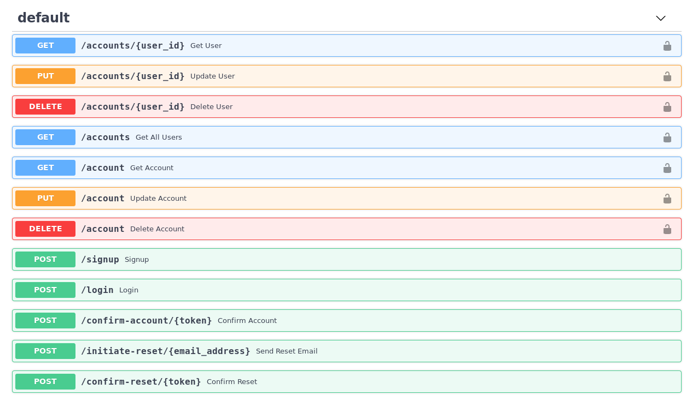

# Microauth
## A fast, documented, and tested python3 API boilerplate application

### Tired of reinventing the wheel every time you need user authentication in a project?

Fill out a simple config file and have RESTful API endpoints for everything needed for account management.




Features:

* Full API documentation via Swagger at `/docs`
* Account confirmation and password resets via email, powered by [Sendgrid](https://sendgrid.com)
* Production Docker setup
* Thorough unit test coverage
* json logging

### Running locally

_uses Python3.6+, Docker, and Docker-compose_

1.  Create a virtual environment for dependencies with `python3 -m venv .venv/`. Activate it with `source .venv/bin/activate`
2.  Install dependencies with `pip3 install -r requirements.txt`
3.  Run `pre-commit install` to configure git commit hooks (for `flake8` checking and `black` formatting)
4.  Copy `default.env` to a new file `.env`
5.  Run `docker-compose up -d database` to run a local PostgreSQL instance for testing and development.
6.  Run test suite with `pytest` _(also initializes database)_.
7.  Run the application with `python3 app/main.py`

View documentation at `http://localhost:8000/docs`

### Production

1.  Create a PostgreSQL instance on the cloud provider of your choice _(AWS, Digital Ocean, etc)_.
2.  Fill out `.env` with your credentials, and change `API_ENV` to `PRODUCTION`.
3.  Initialize the database with `python3 app/utils/init_db.py`
4.  Build the project with `docker build -t microauth .`
5.  Run with `docker run -p 8000:8000 -d microauth`


### Logging

Logs are written in json format to stdout/stderr during local development and to `/var/log/app.log` inside Docker.

```
{"message": "-----------"}
{"message": "Created DEVELOPMENT application"}
{"message": "-----------"}
{"message": null, "method": "POST", "path": "/signup", "request_time": "2019-08-04 21:57:38", "client": {"host": "127.0.0.1", "port": 48786}, "elapsed_ms": "375.78", "status_code": 201}
{"message": null, "method": "POST", "path": "/login", "request_time": "2019-08-04 21:57:42", "client": {"host": "127.0.0.1", "port": 48786}, "elapsed_ms": "37.8", "status_code": 200}
```

### Email Resets (Optional)

If you would like users to be able to verify their email address and reset their passwords, sign up for a [Sendgrid Account](https://sendgrid.com) and add your API Key to `.env`.

[Credit for the email HTML templates](https://github.com/wildbit/postmark-templates)


#### Adding new models

1. Create sqlalchemy model in `app/models/`.
2. Create database queries for the model in `app/db/`
3. Create Pydantic "Schema" in `app/schemas/` for API validation and documentation
4. Import model in `alembic/env.py` and `utils/init_db.py`

Now you should be ready to apply a change to your existing database with alembic.
`alembic revision -m "made some change" --autogenerate` _(generates migration plan in `alembic/versions/`)_
`alembic upgrade head` _(applies database changes)_


#### Testing

Tests are always run against the local docker PostgreSQL instance. The database is re-initialized before each test, and after the last test is run.